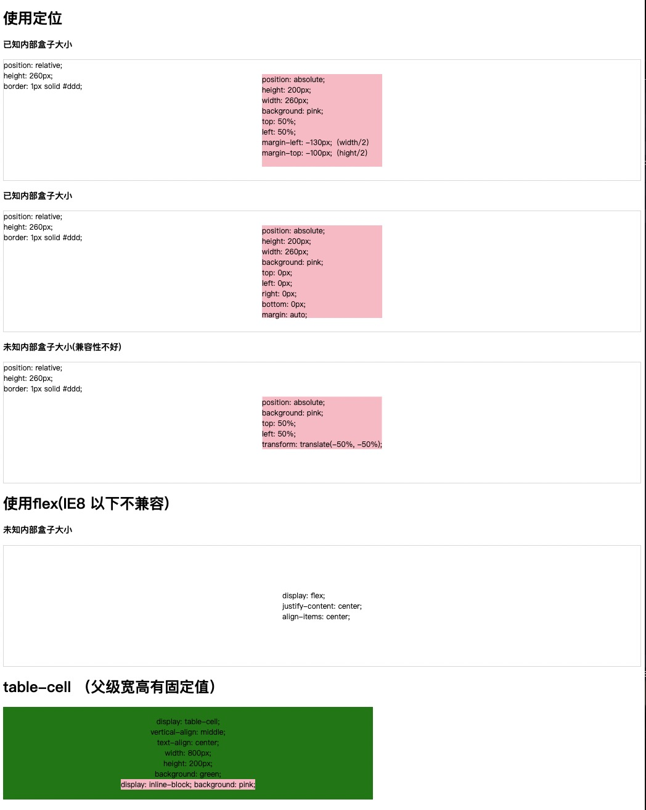
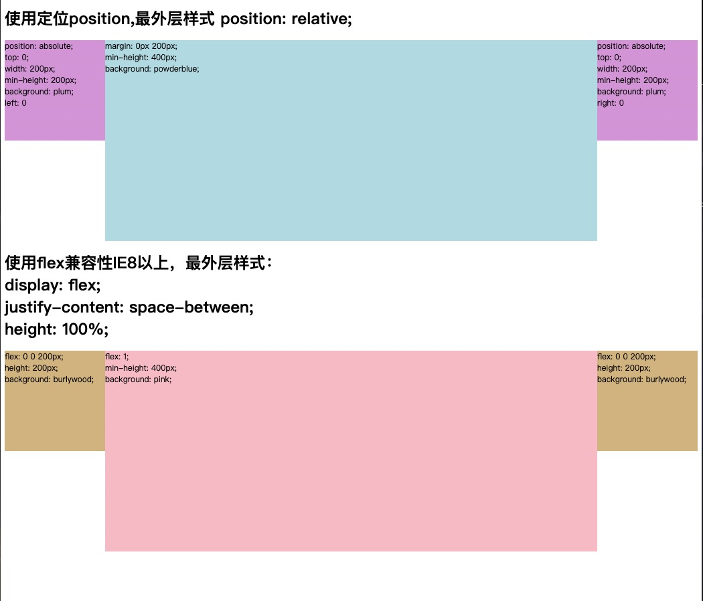
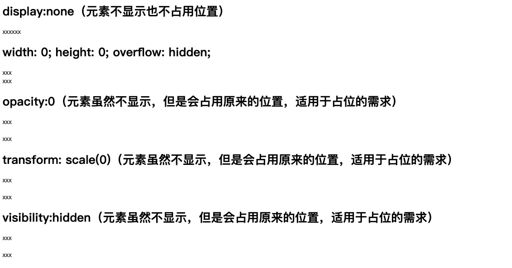
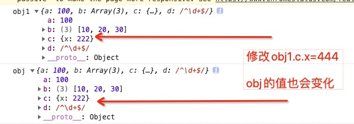
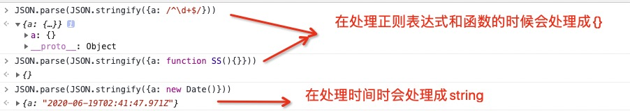
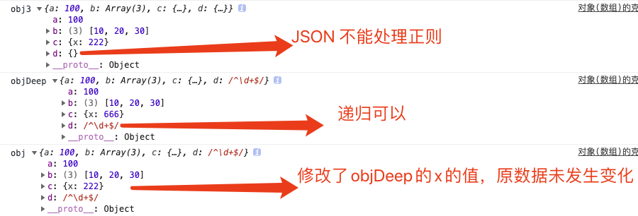

> 图片看不到的可能是DNS污染了需要修改host配置
> - window需要打开 sudo vi /etc/hosts  将以下内容插入即可（或通过查询IP并将其添加至系统hosts文件https://www.ip138.com//）
> 
    52.74.223.119 github.com
    192.30.253.119 gist.github.com
    54.169.195.247 api.github.com
    185.199.111.153 assets-cdn.github.com
    151.101.76.133 raw.githubusercontent.com
    151.101.108.133 user-images.githubusercontent.com
    151.101.76.133 gist.githubusercontent.com
    151.101.76.133 cloud.githubusercontent.com
    151.101.76.133 camo.githubusercontent.com
    151.101.76.133 avatars0.githubusercontent.com
    151.101.76.133 avatars1.githubusercontent.com
    151.101.76.133 avatars2.githubusercontent.com
    151.101.76.133 avatars3.githubusercontent.com
    151.101.76.133 avatars4.githubusercontent.com
    151.101.76.133 avatars5.githubusercontent.com
    151.101.76.133 avatars6.githubusercontent.com
    151.101.76.133 avatars7.githubusercontent.com
    151.101.76.133 avatars8.githubusercontent.com

> - MAC或win可以下载https://oldj.github.io/SwitchHosts/	修改Host

#   前序
前端小月月作者简介公交车,步行了N步后到达了面试公司  前端厂厂

前端小月月走到厂厂的前台接待处：您好,我是前端小月月,是来面试web前端开发岗位的

厂厂的前台说：你好，请做一下，我去给你叫面试官

前端小月月坐在等待区。。。。

------------


厂厂的前台对leader说：有个人来面试，你去面一下吧

leader说：好的

前端小月月看到一个拿着电脑的人朝自己走来，马上站起来说：你好

leader说：你好，请坐

（双双坐下）
------------
# 自我介绍
## leader说：`自我介绍`一下吧

前端小月月说：好的，我是来面试web前端岗位的，在之前的工作中，多使用react开发，有比较丰富的react开发经验，曾经独立完成过一个管理系统的项目，主要使用react全家桶进行开发，也曾担任过项目经理，负责公司官网的开发，鉴于要优化SEO，所以使用了next进行开发，公司内部有一些数据支持项目，接口比较复杂，使用过一段时间的typescript，其他项目大都是内部管理系统，比较倾向于业务。

leader说：你使用react开发，样式管理使用什么

前端小月月说：一般使用 ant design ，单独设计的样式会使用CSS3 自己写（开始给自己挖坑）
# 剧本之CSS场
## leader说：那你说说想要盒子`水平垂直居中`怎么实现

前端小月月说：这种需求在我之前的项目当中非常常见，刚开始的时候使用定位解决，后来随着CSS3的兴起，觉得Flex实现特别方便，尤其是在之前官网开发时在移动端使用起来也非常好，还有一种不常用的，是在看掘金的时候发现的，用display：table-cell也可以实现

> 如果是面试（笔试的话）https://github.com/XinYueXiao/interviewHighlights/tree/master/CSS/centerMiddle.html


## leader说：那你说说`CSS3盒模型有哪些`

前端小月月说:文档里一般说分为标准盒模型和IE盒模型,觉得应该还有`flex`弹性伸缩盒模型,`columns`多列布局盒模型
平时我们使用的是标准盒模型`box-sizing:content-box`是指的`width`和`height`的宽度并不是盒子的实际宽度,实际宽度还需要加上padding、margin、border,在实际应用中如果需要构建一个固定大小的盒子如果需要调整边距,还需要不停的调整盒子的宽高,比较麻烦,看了一些antd的项目的源码,会给盒子默认设置的box-sizing:border-box,调整边距就不会影响之前的布局了。

## leader问：那如果现在需要设计一个`左右固定，中间自适应`的布局怎么处理

前端小月月说：有兼容性要求的话可以使用float，定位实现，这两个需要结合`margin`设置位置，如果不考虑兼容性的话，用flex实现比较简单,直接设置最外层布局为`justify-content: space-between;`，设置左右盒子大小，中间盒子使用`flex:1`即可

> 如果是面试（笔试的话）https://github.com/XinYueXiao/interviewHighlights/tree/master/CSS/leftAndRight.html


## leader问：看你有移动端开发经验，说一下`移动端响应式布局的方案`吧

前端小月月说：主要是media 和 rem ,如果PC和移动使用一个页面，内容差不多使用media，如果是PC移动不一样则使用rem,在我的项目中官网的项目是使用的主页面设计不一样使用的是rem，有一些落地页PC和移动是一样的就是用的是media的方式。也可以结合flex和vh/vw等方式

## leader问：那你在使用css时，让一个div消失在视野中，怎么处理？

前端小月月说：需要看页面设计，如果消失后不占用原来div的位置可以使用简单的属性例如`display:none`，如果占用位置可以使用`visibility:hidden`、`transform: scale(0)`、`opacity:0`等,还有一些不常用的可以设置`width:0`，和`overflow:hidden`等

> 如果是面试（笔试的话）https://github.com/XinYueXiao/interviewHighlights/tree/master/CSS/divhidden.html


## leader问：请说明z-index的工作原理，适用范围
前端小月月说：z-index仅适用于定位元素，就是position为`relative`、`absolute`或者`fixed`，盒子的z-index越大，就越在上面。未定义时，后来者居上，在之前的项目中也使用比较多，像是查号导号的选号车，和淘宝的购物车差不多，一个选择的是账号一个是商品

## leader问：谈谈你对html5的理解

前端小月月说：

- HTML5是最新的第5代HTML标准，提供了丰富的媒体支持，还有媒体类语义化标签，支持跨平台使用
- 拥有多个新表单input输入类型，这些新特性提供了更好的输入控制和验证
- 支持Canvas和SVG，拖放等等

## leader问：如何让一个div里面的文字垂直居中,且该文字的大小根据屏幕的大小自适应

前端小月月说：
我在之前移动端的开发中有遇到相似问题，因为要考虑不同设备的屏幕大小不同，所以文字需要和屏幕大小自适应，通过JavaScript获取视窗的高度给html标签设置基础rem的基准值，在写文字样式时，直接写rem的值就好了

```javascript
        //获取视窗高度
        let htmlWidth = document.documentElement.clientWidth || document.body.clientWidth;
        //获取html
        let htmlDom = document.getElementsByTagName('html')[0]
        //rem的基准值
        htmlDom.style.fontSize = htmlWidth / 10 + 'px'
```
## leader问：不考虑其他因素,下面哪种的渲染性能比较高?

```css
    .box a{  }
    a{  }
```
前端小月月：第二种，因为CCS选择器从右向左查询，第一种需要找到所有的a标签,再找box下所有a。

# 剧本之JavaScript场

## leader说：css比较简单，咱们再说说JavaScript的问题吧
leader在卡片盒子抽出一个面试题
说下这个的输出结果是什么？
```javascript
       var _a = 0,
            _b = 0;
        function A(_a) {
            A = function (_b) {
                alert(_a + _b++)
            }
            alert(_a++)
        }
        A(1) 
        A(2) 
```

小月月进行了以下的思考🤔
```javascript
 var _a = 0,_b = 0
    function A(_a) { //1.执行A(1),_a=1
        A = function (_b) {//2. 在执行完A(1),A以后的赋值指向这里
            alert(_a + _b++)// _a + _b++=1 (_b++，先运算后赋值)
        }
        alert(_a++)//执行_a++先运算后赋值，下次使用时_a=2
    }
    A(1) //1
    A(2) //4 执行function(_b),此时没有a的值，在作用域上下文里找_a=2,执行_a+_b++=2+2=4
```
最终得出结论` “1” “4”`

## leader说:看来你对堆栈有些理解的,那你说一下`深浅克隆`吧

小月月回答：
- 浅克隆只会克隆克隆对象本身，基本数据类型，则会直接复制对应的值，如果是引用类型，赋值的是地址，如果改变复制后的值，会改变原数据的的值，想要实现浅克隆可以直接使用ES6的结构语法即`let obj2 = { ...obj }`也可以使用循环遍历结合`hasOwnProperty`来实现代码如下：

```javascript
 let obj = {
            a: 100,
            b: [10, 20, 30],
            c: { x: 10 },
            d: /^\d+$/
        }

        //浅克隆
        let obj1 = {}
        for (let key in obj) {
            if (!obj.hasOwnProperty(key)) break;
            obj1[key] = obj[key]
        }
        obj1.c.x = 444
        console.log("obj1", obj1)
        console.log("obj", obj)// obj1.c.x = 444后obj.c.x也会变成444
```


- 深拷贝，是把对象赋值给对应的变量，是拷贝对象各个层级的属性，会产生一个新的地址，
- 简单的深克隆可以使用`let obj3 = JSON.parse(JSON.stringify(obj))`,
- 但这个方法会有一些问题，例如：
  - 处理正则表达式和函数是会直接处理成`{}`,
  - 处理时间函数`new Date()`是会处理成字符串

- 如果要解决这个问题还是要使用递归来实现
```javascript
        //深克隆
        let obj3 = JSON.parse(JSON.stringify(obj)) //函数和正则在被JSON.stringify后都会变成{},new Date会变成字符串
        //递归
        console.log("obj3", obj3)
function deepClone(obj) {
            //如果是空直接返回null
            if (obj == 'null') return null
            //如果不是对像，则返回对应值
            if (typeof obj !== 'object') return obj
            //如果是正则则返回新的正则,或者使用Object.prototype.toString.call()判断类型值
            if (obj instanceof RegExp) {
                return new RegExp(obj)//创建新实例,高出新地址
            }
            if (obj instanceof Date) {
                return new Date(obj)
            }
            //不直接创建空对象的目的；克隆的结果和之前的保持相同的所属类
            let objClone = new obj.constructor
            for (let key in obj) {
                if (obj.hasOwnProperty(key)) {
                    objClone[key] = deepClone(obj[key]);//（如果是函数、对象）需递归，其他不需要
                }
            }
            return objClone
        }
        let objDeep = deepClone(obj)
        objDeep.c.x = 666
        console.log("objDeep", objDeep)
        console.log("obj", obj)
```

## leader说:如果现有个变量a,a=什么时条件a==1&&a==2&&a=3成立
```javascript
 var a=?
 if (a == 1 && a == 2 && a == 3) {
    console.log('a == 1 && a == 2 && a == 3');
 }
```
小月月回答在在==是会进行数据转换，数据转换规则是
- 对象==字符串，对象会执行`.toString()`方法变成字符串
- null==undefined，和其他值不相等
- NaN!=NaN
- 其他都会转化为数字

> 这里的a可以同时等于3个数，可以假设a={}，在进行==时会执行`.toString`,在此处重写String
```javascript
 var a = {
            i: 0,
            toString() {
                return ++this.i
            }
        }
 if (a == 1 && a == 2 && a == 3) {
            console.log('a == 1 && a == 2 && a == 3');
 }
```
> 使用数据劫持
```javaScript
   var i = 0
   Object.defineProperty(window, 'a', {
       //get不能再次获取当前属性
       get() {
   return ++i
       }
   })
   if (a == 1 && a == 2 && a == 3) {
       console.log('a == 1 && a == 2 && a == 3');
   }
```
> 使用数据
```javascript
    //数组解决
    var a = [1, 2, 3]
    a.toString = a.shift
    if (a == 1 && a == 2 && a == 3) {
        console.log('a == 1 && a == 2 && a == 3');
    }
```

> 补充：关于面向对象的笔试题
> ```javascript
        function Foo() {
        getName = function () {
            console.log(1);

        }
        return this
        }
        Foo.getName = function () {
            console.log(2);
        }
        Foo.prototype.getName = function () {
            console.log(3);
        }
        var getName = function () {
            console.log(4);
        }
        function getName() {
            console.log(5)
        }
        Foo.getName()
        getName()
        Foo().getName()
        getName()
        new Foo.getName()
        new Foo().getName()
        new new Foo().getName()
> ```
> 解析

> 关于同步异步的笔试题
> ```javascript
        async function async1() {
            console.log('async1 start')
            await async2()
            console.log('async1 end')
        }
        async function async2() {
            console.log('async2')
        }
        console.log('script start');
        setTimeout(function () {
            console.log('setTimeout');
        }, 0);
        async1()
        new Promise(function (resolve) {
            console.log('promise1');
            resolve()
        }).then(function () {
            console.log('promise2');
        })
        console.log('script end');
> ```
> 解析
